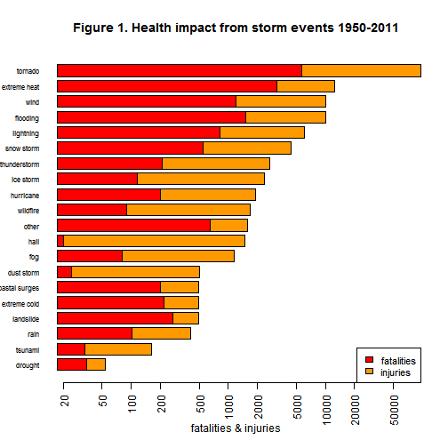
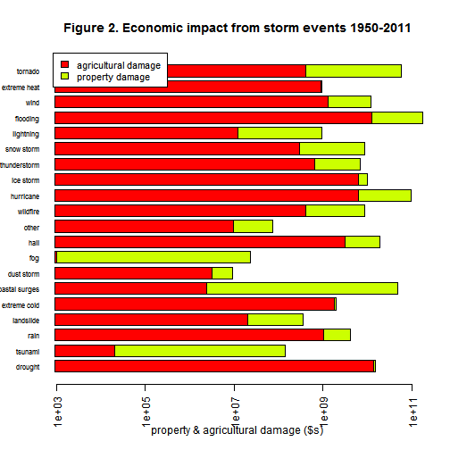
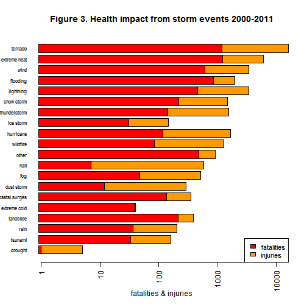

## Synopsis  
This is a report on the health and economic impacts of storm event types categorized in the **NOAA Storm Database** over the time period 1950-2011. The objective is to analyze the database to determine:  
1. which events were most harmful to human health, and  
2. which events have the greatest economic impact.  
Human health impacts are assessed via the total number of fatalities and injuries associated with event types. Economic impacts are assessed by totaling property and agricultural damages associated with event types. The analysis shows that tornado events have caused the largest number of fatalities and injuries. Flooding causes the greatest amount of total and property damage economic impact, while drought causes the most agricultural damage (flooding is also a close second for agricultural damage). As significant changes in population distribution, building codes, regulations, development intensity, and climate have likely occurred since 1950, the database was subsetted to look at the whether results were the same for a more recent period, 2000-2011. The data shows that "extreme heat" event types have overtaken "tornados" as having the largest impact on fatalities. This result may deserve futher investigation in light of US National Climate Assessment Report (2014) predictions for more frequenct and longer heat duration events the coming decades.  

## Section 1. Data Processing  

The data for this project was taken from the **NOAA Storm Database**. This database tracks and categorizes details and impacts of all weather events across the US. The following code downloads the version of the database provided for this project. The NOAA Storm Database categorizes storm related events with 37 variables; those of particular importance with regard to this analysis are variables that present: the event type, date, location, impact on human health (fatalities and injuries), and economic damage (structural and agricultural). So, given the large size of the data base, the initial processing strips out unnecessary data to improve the speed of manipulation. 


```r
library(R.utils)
```

```
## Loading required package: R.oo
## Loading required package: R.methodsS3
## R.methodsS3 v1.6.1 (2014-01-04) successfully loaded. See ?R.methodsS3 for help.
## R.oo v1.18.0 (2014-02-22) successfully loaded. See ?R.oo for help.
## 
## Attaching package: 'R.oo'
## 
## The following objects are masked from 'package:methods':
## 
##     getClasses, getMethods
## 
## The following objects are masked from 'package:base':
## 
##     attach, detach, gc, load, save
## 
## R.utils v1.32.4 (2014-05-14) successfully loaded. See ?R.utils for help.
## 
## Attaching package: 'R.utils'
## 
## The following object is masked from 'package:utils':
## 
##     timestamp
## 
## The following objects are masked from 'package:base':
## 
##     cat, commandArgs, getOption, inherits, isOpen, parse, warnings
```

```r
library(data.table)
pa2 <- "http://d396qusza40orc.cloudfront.net/repdata%2Fdata%2FStormData.csv.bz2"
download.file(url=pa2, destfile="NOAAStorm.csv.bz2")
# NOAAStorm.csv is large (~540Mb), the following steps are slow
bunzip2("NOAAStorm.csv.bz2", overwrite=TRUE)
StormDB <- read.csv("NOAAStorm.csv", stringsAsFactors=FALSE, 
                na.strings=c("", "NA", "Not Available", "?"))
StormDT <- data.table(StormDB)
# remove columns that are unnecessary for this analysis
StormDT <- StormDT[, c(1,3:5, 9:22, 29:37):= NULL]
# convert key column data to lower case for ease of processing
StormDT <- StormDT[, EVTYPE:= tolower(EVTYPE)]
StormDT <- StormDT[, PROPDMGEXP:= tolower(PROPDMGEXP)]
StormDT <- StormDT[, CROPDMGEXP:= tolower(CROPDMGEXP)]
```
  
Details on the conventions and codes authorities use to report storm events to the database can be found at [Storm Data Documentation](https://d396qusza40orc.cloudfront.net/repdata%2Fpeer2_doc%2Fpd01016005curr.pdf). The database documentation lists 48 event type categories (variable name EVTYPE in NOAA Storm Database) and provides extensive complex documentation for characterizing events. Given that storm events are often complex containing multiple components that are open to interpretation (one person's snow is another's sleet and so on), the event type variable (EVTYPE) in the NOAA Storm Database does not consist of a manageable number of levels. In fact, after removing upper/lower case variations, there are still 898 unique event type entries in the database, some examples include:  
1. 15 unique entries for *tornado*,  
2. 220 for *wind*, and  
3. 101 for *flood*.  
Accordingly, it is necessary to process event types into summary factor categories.  

On problem in summarizing EVTYPE in factors is event type entries (EVTYPE) often have multiple types per entry. For example, many thunderstorm entries also reference wind and hail and rain, in the same EVTYPE field, and so on. As thunderstorms often have damaging winds, I have made the choice to prioritize thunderstorms and by pulling thunderstorm first, then by overwriting the entry in EVTYPE, I eliminate double counting into the factor summary. Entries that just reference wind are counted as such.  


```r
# I found it necessary to re-source data.table again, perhaps due to caching
# in the first code chunk -- not sure but it works
library(data.table)
# the order of EVtypesearch was setup to deal with multiple entries
# as described in the text
EVtypesearch <- c("hurricane|tropical|typhoon", 
                  "coastal|storm surge|surf|tide|erosion", 
                  "avalanche|landslide|mud slide|mudslide|slide", 
                  "flood|dam|flooding", "tornado|funnel cloud|waterspout", 
                  "hail", "snow|blizzard|winter", 
                  "ice|freezing rain|frost|sleet|freezing|icy", 
                  "thunderstorm", "wind|microburst|gustnado|wnd", 
                  "rain|wet|precipitation|shower|precip", "lightning", 
                  "drought|dry", "heat|hot|high temperature|warm", "tsunami", 
                  "dust", "cold|cool|freeze", "fire|wildfire|smoke", "fog")
EVfactorlist <- c("hurricane", "coastal surges", "landslide", "flooding", 
                "tornado", "hail", "snow storm", "ice storm", "thunderstorm", 
                "wind", "rain", "lightning", "drought", "extreme heat", 
                "tsunami", "dust storm", 
                "extreme cold", "wildfire", "fog", "other")
EVdescription <- c("hurricane & tropical storms/depressions",
                   "coastal flooding & storm surges",
                   "avalanches, landslides, and mud/debris flows",
                   "inland flooding & flash flooding",
                   "tornados all classes & waterspouts",
                   "hail not captured as thunderstorms",
                   "snow storms & blizzards",
                   "ice storms, freezing rain, frosts, & sleet",
                   "thunderstorms", "wind not as thunderstorm or tornado",
                   "rain", "lightning", "drought", "extreme heat or heat waves",
                   "tsunami", "dust storms", "extreme cold", 
                   "wildfires includes forest & brush", "fog", 
                   "seiche & volcanic ash events, and mislabeled types")
EVDT <- data.frame(EVfactorlist, EVdescription)
print("Table 1. Factors (EVfactorlist) and definitions (EVdescription) for event types.")
```

```
## [1] "Table 1. Factors (EVfactorlist) and definitions (EVdescription) for event types."
```

```r
EVDT
```

```
##      EVfactorlist                                      EVdescription
## 1       hurricane            hurricane & tropical storms/depressions
## 2  coastal surges                    coastal flooding & storm surges
## 3       landslide       avalanches, landslides, and mud/debris flows
## 4        flooding                   inland flooding & flash flooding
## 5         tornado                 tornados all classes & waterspouts
## 6            hail                 hail not captured as thunderstorms
## 7      snow storm                            snow storms & blizzards
## 8       ice storm         ice storms, freezing rain, frosts, & sleet
## 9    thunderstorm                                      thunderstorms
## 10           wind                wind not as thunderstorm or tornado
## 11           rain                                               rain
## 12      lightning                                          lightning
## 13        drought                                            drought
## 14   extreme heat                         extreme heat or heat waves
## 15        tsunami                                            tsunami
## 16     dust storm                                        dust storms
## 17   extreme cold                                       extreme cold
## 18       wildfire                  wildfires includes forest & brush
## 19            fog                                                fog
## 20          other seiche & volcanic ash events, and mislabeled types
```

```r
StormDT <- StormDT[, EVfactor:= "other"]
for(i in seq_along(EVtypesearch)){
        StormDT <- StormDT[grep(EVtypesearch[i], StormDT$EVTYPE), 
                           EVfactor:= EVfactorlist[i]]
        # overwrite EVTYPE to address multiple counting
        StormDT <- StormDT[grep(EVtypesearch[i], StormDT$EVTYPE), 
                           EVTYPE:= EVfactorlist[i]]
}
StormDT <- StormDT[, EVfactor:= factor(EVfactor)]
# remove old EVTYPE column
StormDT <- StormDT[, EVTYPE:= NULL]
```
  
The event factors list initially included "seiche" and "volcanic ash", however, on inspection of the analysis results these events did not have significant health or economic impacts, accordingly "sieche" and "volcanic ash" categories were relegated into the "other" factor. After applying this data processing, a number of mislabeled or poorly labeled uncategorized EVTYPE factors remained, these events were lumped into the "other" factor. By including "other", and therefore counting the total health and economic impacts not assigned, we can determine whether further work to clean up "other" is necessary, *i.e.*, whether it may change our conclusions.  
 
According to the NOAA Storm Database documentation, property and crop damage estimates are reported with "K", "M", and "B" factors to indicate whether damage estimate values should be multiplied by 10^3^, 10^6^, and 10^9^ respectively. As with EVTYPE entries, entries into  property and crop multiplier factors columns are polluted with with nonappropriate entries. For this report it was not practical to investigate deviant entries, so all entries not conforming to the proper format will be ignored and a multiplier of 1 assumed.  


```r
multiplierfactor <- c("k", "m", "b")
multiplier <- c(10^3, 10^6, 10^9)
for (i in seq_along(multiplierfactor)){
        StormDT <- StormDT[grep(multiplierfactor[i], StormDT$PROPDMGEXP), 
                           PROPDMG:= PROPDMG*multiplier[i]]
        StormDT <- StormDT[grep(multiplierfactor[i], StormDT$CROPDMGEXP), 
                           CROPDMG:= CROPDMG*multiplier[i]]
}
# removing columns that are now unnecessary
StormDT <- StormDT[, PROPDMGEXP:= NULL]
StormDT <- StormDT[, CROPDMGEXP:= NULL]
```
  
The final processing step is to prepare the data for results discussion. Two parallel datasets are prepare, one summarizing impacts over the full history of the database, 1950-2011, and one for more recent history, 2000-2011.
  

```r
library(reshape2)
StormDT <- StormDT[, BGN_DATE:= year(strptime(BGN_DATE, "%m/%d/%Y"))]
# subset dataset to recent history >= 2000
StormDT2000 <- StormDT[BGN_DATE >= 2000,]
# prepare 1950-2011 data
StormDT <- melt(StormDT, id.vars=c("EVfactor"), measure.vars=c("FATALITIES", 
                "INJURIES", "PROPDMG", "CROPDMG"), na.rm=TRUE)
StormDT <- dcast.data.table(StormDT, EVfactor~variable, sum)
# same for 2000-2011 data
StormDT2000 <- melt(StormDT2000, id.vars=c("EVfactor"), 
                        measure.vars=c("FATALITIES", "INJURIES", "PROPDMG", 
                        "CROPDMG"), na.rm=TRUE)
StormDT2000 <- dcast.data.table(StormDT2000, EVfactor~variable, sum)

# order StormDT by impact on total health, reorder factors
StormDT <- StormDT[, health:= FATALITIES+INJURIES]
StormDT <- StormDT[order(health, decreasing=FALSE)]
healthlevels <- as.character(StormDT$EVfactor)

# reorder factor levels for ordered plotting
# will use same factor levels for economic impact and 2000-2011 data
StormDT <- StormDT[, EVfactor:= factor(EVfactor, levels=healthlevels)]
StormDT2000 <- StormDT2000[, EVfactor:= factor(EVfactor, levels=healthlevels)]
StormDT2000 <- StormDT2000[order(EVfactor, decreasing=FALSE)]


# reformat StormDT as matrix (required for stacked barplot capability)
StormMat <- t(as.matrix(StormDT[, c(1, 6):= NULL]))
colnames(StormMat) <- healthlevels
StormMat2000 <- t(as.matrix(StormDT2000[, 1:= NULL]))
colnames(StormMat2000) <- healthlevels

# in StormMat, crop damage = $0 for "fog" events, this was set to a 
# nominally insignificant value of $1000 to allow including this factor 
# in Figure 2 plot, this has no effect on the Results and Synopis presented
StormMat[4, 8] <- 1000

# in STormMat2000, there are no fatalities from "drought" events, or injuries 
# from "extreme cold", as above, these were set to nominally insignificant
# values of 1, this has no effect on the Results and Synopsis presented
StormMat2000[1, 1] <- 1
StormMat2000[2,5] <- 1
```
  
## Section 2. Results  
Total health impact with respect to the event types listed in Table 1 can be assessed from the total number of fatalities and injuries attributed to that event type. Figure 1 shows that "tornado"" related events have had the greatest impact (for both fatalities and injuries) over the time period (1950-2011) covered by the NOAA Storm Dataebase. Other event types that show significant health impacts include: "extreme heat", "wind", "flooding", and "lightning". As explain in the data analysis section, the "other" category captures health impacts associated primarily with events that are poorly classified or mislabeled. While the "other" category shows a significant health impact, further analysis to fix those classification are unlikely to affect the conclusions drawn in the above comments.


```r
barplot(StormMat[1:2,], width=1, horiz=TRUE, space=0.3, cex.name=.7, log="x", las=2, col=rainbow(10), xlab="fatalities & injuries", main="Figure 1. Health impact from storm events 1950-2011")
legend("bottomright", fill=rainbow(10), cex=0.9, legend=c("fatalities", "injuries"))
```

 
  
**Figure 1.** Total health impact (fatalities and injuries) attributed to storm events in the NOAA Storm Database over the period 1950 to November 2011. Note that fatalities and injuries are plotted on a log scale so that the length of the bar for injuries relative to fatalities does not necessarily reflect the amount.  
  
Total economic impact is measured in the NOAA Storm Database in terms of property damage and crop (agricultural) damage variables. Economic impact was determined with respect to the event types listed in Table 1. Figure 2 shows that "flooding" related events have had the greatest total economic impact over the time period (1950-2011) covered in the NOAA Storm Database. With regard to agricultural damage, "drought" and "flooding" have had the greatest impacts. With regard to property damage, "flooding", "hurricanes", "tornados", and "coastal surges" have had the greatest impact. As discussed for Figure 1, the "other" category captures impacts associated primarily with events that are poorly classified or mislabeled. The inderminate econonic losses  captured in the "other" category are not significant with respect to the conclusions drawn in the above comments.


```r
barplot(StormMat[4:3,], width=1, horiz=TRUE, space=0.3, cex.name=.7, log="x", las=2, col=rainbow(5), xlab="property & agricultural damage ($s)", main="Figure 2. Economic impact from storm events 1950-2011")
legend("topleft", fill=rainbow(5), bg="white", cex=0.9, legend=c("agricultural damage", "property damage"))
```

 
  
**Figure 2.** Total economic impact (agricultural and property damage) attributed to storm events in the NOAA Storm Database over the period 1950 to November 2011. Note that damage $s are reported on a log scale (see comments in Figure 1 caption). Also note that as described in the section 1, agricultural impacts from "fog" events were adjusted to a small nominally insignificant value to allow inclusion of this event in the plot.  

The NOAA Storm Database covers ~60 years of event impacts. Over that time, considerable changes have occurred, in particular, in population distribution, building codes, regulations, development intensity and patterns, and climate to name a few. Therefore we might expect to draw different conclusions if a narrower more recent time frame was reviewed. Figure 3 shows total health impacts for the same event types, but for the more recent time period 2000-2011. While "tornado" events continue to produce the greatest number of injuries, fatalities associated with "extreme heat" events have surpassed "tornados". No significant changes in the order of highest impact events for economic consequences were observed (not shown), both for property and agricultural damage. A potential trend to greater impact of "extreme heat" events on human health  may deserve further investigation, particularly in light of the predicted trend of more frequent and greater duration heatwave events forecast for high density urban areas as described in the [US National Climate Assessment Report 2014](nca2014.globalchange.gov).  


```r
barplot(StormMat2000[1:2,], width=1, horiz=TRUE, space=0.3, cex.name=.7, log="x", las=2, col=rainbow(10), xlab="fatalities & injuries", main="Figure 3. Health impact from storm events 2000-2011")
legend("bottomright", fill=rainbow(10), cex=0.9, legend=c("fatalities", "injuries"))
```

 
  
**Figure 3.** Total health impact (fatalities and injuries) attributed to storm events in the NOAA Storm Database over the period 2000 to November 2011. Note that fatalities and injuries for "drought" and "extreme cold" events respectively were adjusted to a small nominally insignificant value to allow inclusion of these events in the plot.  

